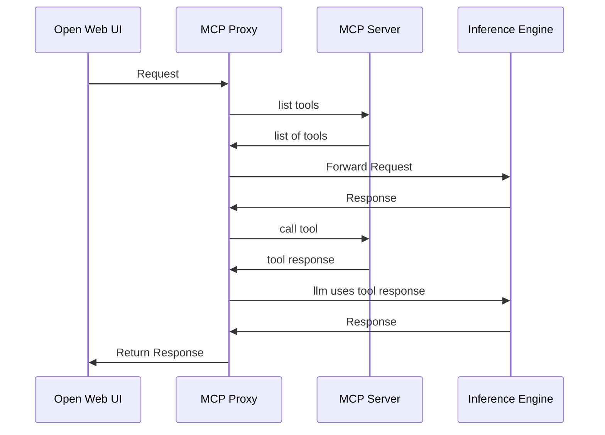

# MCP-Bridge
A middleware to provide an openAI compatible endpoint that can call MCP tools. MCP-Bridge acts as a bridge between the OpenAI API and MCP (MCP) tools, allowing developers to leverage MCP tools through the OpenAI API interface.

## Overview
MCP-Bridge is designed to facilitate the integration of MCP tools with the OpenAI API. It provides a set of endpoints that can be used to interact with MCP tools in a way that is compatible with the OpenAI API. This allows you to use any client with any MCP tool without explicit support for MCP. For example, see this example of using Open Web UI with the official MCP fetch tool. 


## current features
- non streaming chat completions with MCP
- non streaming completions without MCP

- streaming chat completions are not implemented yet
- streaming completionsare not implemented yet

- MCP tools are supported
- MCP resources are planned to be supported

## Installation

The recommended way to install MCP-Bridge is to use Docker. See the example compose.yml file for an example of how to set up docker. 

Note that this requires an inference engine with tool call support. I have tested this with vLLM with success, though ollama should also be compatible.

### Docker installation

1. **Clone the repository**

2. **Edit the compose.yml file**

You will need to add a reference to the config.json file in the compose.yml file. Pick any of
- add the config.json file to the same directory as the compose.yml file and use a volume mount (you will need to add the volume manually)
- add a http url to the environment variables to download the config.json file from a url
- add the config json directly as an environment variable

see below for an example of each option:
```bash
environment:
  - MCP_BRIDGE__CONFIG__FILE=config.json # mount the config file for this to work
  - MCP_BRIDGE__CONFIG__HTTP_URL=http://10.88.100.170:8888/config.json
  - MCP_BRIDGE__CONFIG__JSON={"inference_server":{"base_url":"http://example.com/v1","api_key":"None"},"mcp_servers":{"fetch":{"command":"uvx","args":["mcp-server-fetch"]}}}
```

3. **run the service**
```
docker-compose up --build -d
```

### Manual installation (no docker)

If you want to run the application without docker, you will need to install the requirements and run the application manually.

1. **Clone the repository**

2. **Set up a virtual environment:**
```bash
python3 -m venv .venv
source .venv/bin/activate
```

3. **Install the requirements:**
```bash
pip install -r requirements.txt
```

4. **Create a config.json file in the root directory**

Here is an example config.json file:
```json
{
   "inference_server": {
      "base_url": "http://example.com/v1",
      "api_key": "None"
   },
   "mcp_servers": {
      "fetch": {
        "command": "uvx",
        "args": ["mcp-server-fetch"]
      }
   }
}
```

5. **Run the application:**
```bash
python mcp_bridge/main.py
```

## Usage
Once the application is running, you can interact with it using the OpenAI API.

View the documentation at [http://yourserver:8000/docs](http://localhost:8000/docs). There is an endpoint to list all the MCP tools available on the server, which you can use to test the application configuration.

## Configuration

To add new MCP servers, edit the config.json file.

an example config.json file with most of the options explicitly set:

```json
{
    "inference_server": {
        "base_url": "http://localhost:8000/v1",
        "api_key": "None"
    },
    "mcp_servers": {
        "fetch": {
            "command": "uvx",
            "args": [
                "mcp-server-fetch"
            ]
        }
    },
    "network": {
        "host": "0.0.0.0",
        "port": 9090
    },
    "logging": {
        "log_level": "DEBUG"
    }
}
```

| Section          | Description                        |
| ---------------- | ---------------------------------- |
| inference_server | The inference server configuration |
| mcp_servers      | The MCP servers configuration      |
| network          | uvicorn network configuration      |
| logging          | The logging configuration          |

## How does it work

The application sits between the OpenAI API and the inference engine. An incoming request is modified to include tool definitions for all MCP tools available on the MCP servers. The request is then forwarded to the inference engine, which uses the tool definitions to create tool calls. MCP bridge then manage the calls to the tools. The request is then modified to include the tool call results, and is returned to the inference engine again so the LLM can create a response. Finally, the response is returned to the OpenAI API.



## Contribution Guidelines
Contributions to MCP-Bridge are welcome! To contribute, please follow these steps:
1. Fork the repository.
2. Create a new branch for your feature or bug fix.
3. Make your changes and commit them.
4. Push your changes to your fork.
5. Create a pull request to the main repository.

## License
MCP-Bridge is licensed under the MIT License. See the [LICENSE](LICENSE) file for more information.
